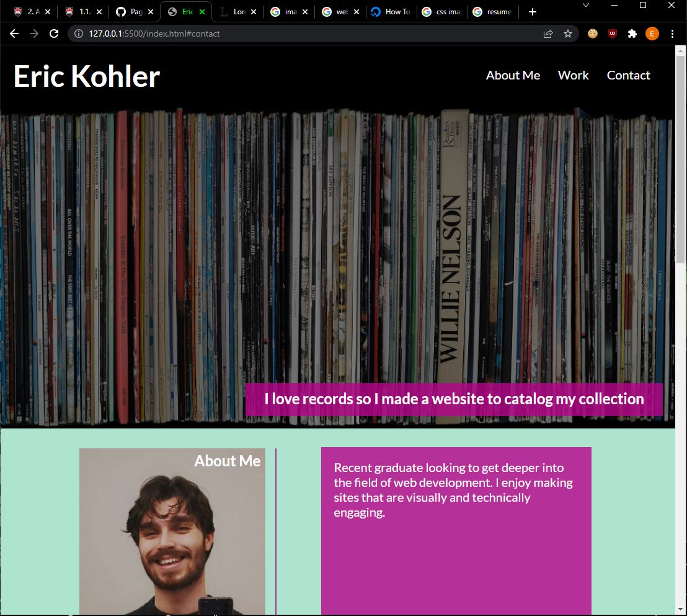
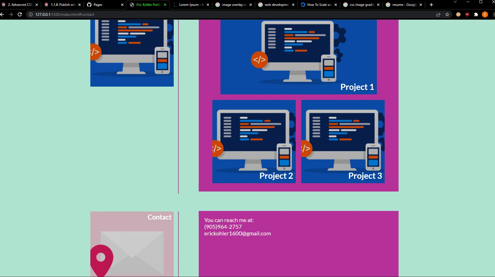

# Challenge-2-Portfolio
Tasked with creating a portfolio page to showcase my work.
I built a single page with a navigation that directs to about me, work and contact.
I also included a banner which goes to one other project I've made in the past.
The rest of the content is filler for now mainly until I create more down the road.

Link to live site: https://eikohler.github.io/Challenge-2-Portfolio/

